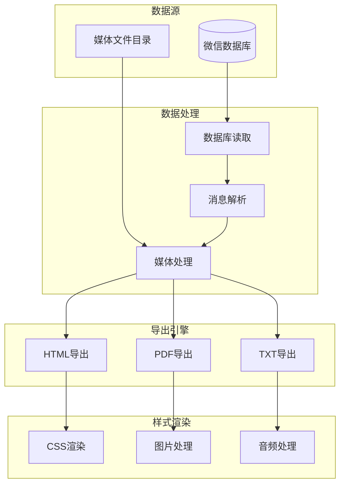

# 📤 fork-WechatExporter - 微信聊天记录导出工具


## 📦 项目来源

- **原项目**: [lc/WechatExporter](https://github.com/lc/WechatExporter)
- **原作者**: lc
- **开源协议**: MIT License
- **Fork时间**: 2024年

## 🔧 二次开发内容

本项目为原项目的学习研究版本,主要用于:
- 学习Go语言的文件处理技术
- 研究数据库读取和数据转换方法
- 了解跨平台应用的开发流程

## ⚠️ 免责声明

本项目仅供学习研究使用,请勿用于非法用途。使用本项目所产生的一切后果由使用者自行承担。

## 📖 项目简介

fork-WechatExporter是基于Go语言开发的微信聊天记录导出工具,支持将微信聊天记录导出为HTML、PDF等格式,保留原始聊天样式。

## 🏗️ 系统架构



## ⚠️ 免责声明

**本项目仅供个人学习和研究使用,请勿用于非法用途。**

## 🚀 快速开始

```bash
# 克隆项目
git clone https://github.com/yourusername/fork-WechatExporter.git

# 编译项目
go build -o wechat_exporter

# 运行
./wechat_exporter -input ./db -output ./output
```

## 💡 核心示例

### 数据库读取

```go
package main

import (
    "database/sql"
    "fmt"
    _ "github.com/mattn/go-sqlite3"
)

type Message struct {
    MsgID      int64
    Talker     string
    Sender     string
    Content    string
    CreateTime int64
    Type       int
}

func ReadMessages(dbPath string) ([]Message, error) {
    db, err := sql.Open("sqlite3", dbPath)
    if err != nil {
        return nil, err
    }
    defer db.Close()
    
    rows, err := db.Query(`
        SELECT msgId, talker, sender, content, createTime, type
        FROM MSG
        ORDER BY createTime ASC
    `)
    if err != nil {
        return nil, err
    }
    defer rows.Close()
    
    var messages []Message
    for rows.Next() {
        var msg Message
        err := rows.Scan(
            &msg.MsgID,
            &msg.Talker,
            &msg.Sender,
            &msg.Content,
            &msg.CreateTime,
            &msg.Type,
        )
        if err != nil {
            return nil, err
        }
        messages = append(messages, msg)
    }
    
    return messages, nil
}
```

### HTML导出

```go
package main

import (
    "html/template"
    "os"
)

const htmlTemplate = `
<!DOCTYPE html>
<html>
<head>
    <meta charset="UTF-8">
    <title>微信聊天记录</title>
    <style>
        .message {
            margin: 10px 0;
            padding: 10px;
            border-radius: 5px;
        }
        .sent {
            background-color: #95EC69;
            text-align: right;
        }
        .received {
            background-color: #FFFFFF;
        }
    </style>
</head>
<body>
    <h1>微信聊天记录导出</h1>
    {{range .Messages}}
    <div class="message {{if eq .Sender "self"}}sent{{else}}received{{end}}">
        <div class="time">{{.CreateTime}}</div>
        <div class="content">{{.Content}}</div>
    </div>
    {{end}}
</body>
</html>
`

func ExportToHTML(messages []Message, outputPath string) error {
    tmpl, err := template.New("chat").Parse(htmlTemplate)
    if err != nil {
        return err
    }
    
    file, err := os.Create(outputPath)
    if err != nil {
        return err
    }
    defer file.Close()
    
    data := struct {
        Messages []Message
    }{
        Messages: messages,
    }
    
    return tmpl.Execute(file, data)
}
```

## 🎯 核心特性

- **高性能**: Go语言开发,处理速度快
- **多格式**: 支持HTML/PDF/TXT导出
- **样式保留**: 保留原始聊天样式
- **媒体支持**: 支持图片、视频、语音导出
- **跨平台**: Windows/Linux/macOS

## 📝 更新日志

### v1.0.0 (2024-01-01)
- ✨ 初始版本发布
- ✨ 完成数据库读取
- ✨ 完成HTML导出

---

⭐ 如果这个项目对你有帮助,欢迎Star支持!
